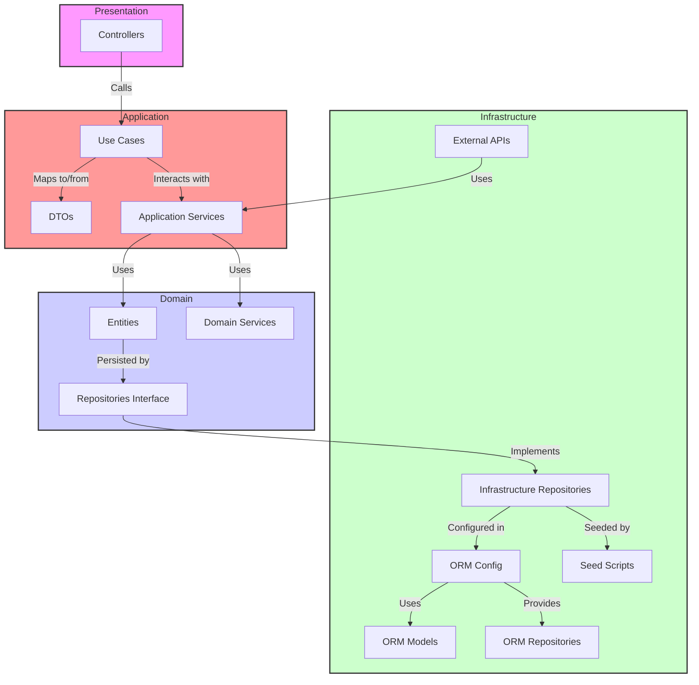
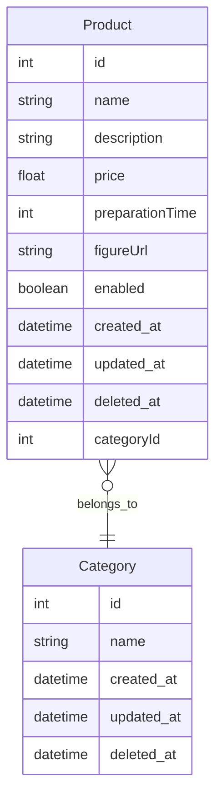

# Tech Challenge - Catálogo de Produtos


[](https://sonarcloud.io/summary/new_code?id=Grupo-26-FIAP_tech-challenge-product-catalog)
[](https://sonarcloud.io/summary/new_code?id=Grupo-26-FIAP_tech-challenge-product-catalog)

Bem-vindo ao repositório do **Tech Challenge - Catálogo de Produtos**! Este projeto faz parte do ecossistema desenvolvido pelo Grupo 26 da FIAP, sendo responsável pela gestão de produtos dentro da plataforma.

## ✨ Visão Geral

O **Tech Challenge - Catálogo de Produtos** é um microsserviço essencial para a manutenção do portfólio de produtos. Ele permite a criação, leitura, atualização e remoção de produtos, garantindo a consistência das informações no ecossistema.

## 🛠 Tecnologias Utilizadas

- **NestJS** - Framework Node.js para aplicações escaláveis.
- **TypeScript** - Linguagem tipada para JavaScript.
- **PostgreSQL** - Banco de dados relacional.
- **TypeORM** - ORM para gerenciar a persistência de dados.
- **Jest** - Framework para testes automatizados.
- **Docker** - Contêinerização da aplicação.

## 🔧 Instalação e Configuração

### Requisitos
Antes de começar, certifique-se de ter instalado:
- [Node.js](https://nodejs.org/)
- [Docker](https://www.docker.com/)
- [PostgreSQL](https://www.postgresql.org/)

### Passos para Execução

1. Clone este repositório:
   ```bash
   git clone https://github.com/Grupo-26-FIAP/tech-challenge-product-catalog.git
   cd tech-challenge-product-catalog
   ```

2. Instale as dependências:
   ```bash
   npm install
   ```

3. Configure as variáveis de ambiente:
   Crie um arquivo `.env` na raiz do projeto e adicione as configurações necessárias.

4. Execute o banco de dados com Docker:
   ```bash
   docker-compose up -d
   ```

5. Inicie o servidor:
   ```bash
   npm run start:dev
   ```

6. A API estará disponível em `http://localhost:3002`

## 📈 Endpoints Principais

Abaixo estão alguns dos principais endpoints da API:

### Criar um Produto
```http
POST /products
```
**Body:**
```json
{
  "name": "Produto X",
  "category": "Eletrônicos",
  "price": 199.99,
  "description": "Um excelente produto",
  "imageUrl": "http://link-da-imagem.com",
  "enabled": true
}
```

### Buscar Todos os Produtos
```http
GET /products
```

### Buscar Produto por ID
```http
GET /products/{id}
```

### Atualizar um Produto
```http
PUT /products/{id}
```

### Deletar um Produto
```http
DELETE /products/{id}
```

## 💡 Testes

Para rodar os testes, utilize o seguinte comando:
```bash
npm run test
```
Para verificar a cobertura de testes:
```bash
npm run test:cov
```

## Diagrama de Arquitetura Limpa

O diagrama abaixo ilustra a interação entre as diferentes camadas e componentes da arquitetura limpa do projeto. Esta arquitetura é projetada para promover uma separação clara entre as diferentes responsabilidades do sistema, facilitando a manutenção e evolução da aplicação.



## Documentação do Banco de Dados

Este documento descreve a estrutura do banco de dados utilizado no projeto. Inclui a descrição de cada tabela, suas colunas e os relacionamentos entre elas.



## 🔍 Contribuição

Siga os passos abaixo para contribuir com o projeto:

1. Faça um fork do repositório.
2. Crie uma branch para a sua feature: `git checkout -b minha-feature`.
3. Commit suas alterações: `git commit -m 'Adicionando minha feature'`.
4. Envie para o repositório: `git push origin minha-feature`.
5. Abra um Pull Request.

## 👥 Time de Desenvolvimento

| Nome                           | RM           | E-mail                                                             | GitHub                                             |
| ------------------------------ | ------------ | ------------------------------------------------------------------ | -------------------------------------------------- |
| Jhoni Farias                   | **RM357358** | [jhonifarias.developer@gmail.com](jhonifarias.developer@gmail.com) | [@JhoniFarias](https://github.com/JhoniFarias)     |
| Josef Henrique Zambreti        | **RM357836** | [josefhenrique@uol.com.br](josefhenrique@uol.com.br)               | [@Josefhz](https://github.com/Josefhz)             |
| Lucas Rodrigues Medina Costa   | **RM357360** | [lucasmedinarmc@gmail.com](lucasmedinarmc@gmail.com)               | [@diname](https://github.com/diname)               |
| Kleber de Oliveira Andrade     | **RM358012** | [pdjkleber@gmail.com](pdjkleber@gmail.com)                         | [@kleberandrade](https://github.com/kleberandrade) |
| Vitória Camila Xavier Sobrinho | **RM357235** | [vcamilaxs@gmail.com](vcamilaxs@gmail.com)                         | [@itsvickie](https://github.com/itsvickie)         |

## ⚖ Licença

Este projeto está sob a licença MIT - veja o arquivo [LICENSE](LICENSE) para mais detalhes.

---

Feito com ❤️ pelo **Grupo 26 - FIAP**
