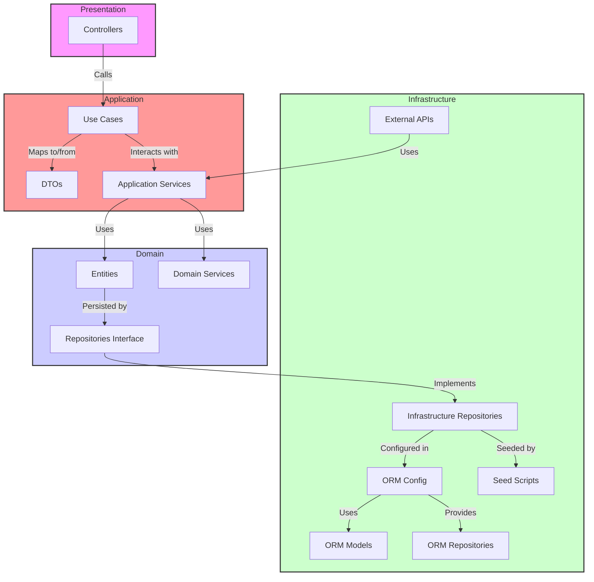
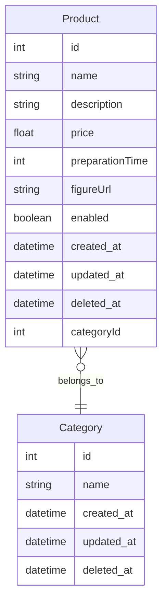

[](https://sonarcloud.io/summary/new_code?id=Grupo-26-FIAP_tech-challenge-product-catalog)
[](https://sonarcloud.io/summary/new_code?id=Grupo-26-FIAP_tech-challenge-product-catalog)


# Tech Challenge Product Catalog

Tech Challenge é o projeto do MBA em Software Architecture que engloba os conhecimentos obtidos nas disciplinas.

## O Problema

Há uma lanchonete de bairro que está expandindo devido seu grande sucesso. Porém, com a expansão e sem um sistema de controle de pedidos, o atendimento aos clientes pode ser caótico e confuso. Por exemplo, imagine que um cliente faça um pedido complexo, como um hambúrguer personalizado com ingredientes específicos, acompanhado de batatas fritas e uma bebida. O atendente pode anotar o pedido em um papel e entregá-lo à cozinha, mas não há garantia de que o pedido será preparado corretamente.

Sem um sistema de controle de pedidos, pode haver confusão entre os atendentes e a cozinha, resultando em atrasos na preparação e entrega dos pedidos. Os pedidos podem ser perdidos, mal interpretados ou esquecidos, levando à insatisfação dos clientes e a perda de negócios.

**Gerenciar produtos e categorias**: Os produtos dispostos para escolha do cliente serão gerenciados pelo estabelecimento, definindo nome, categoria, preço, descrição e imagens. Para esse sistema teremos categorias fixas:

- Lanche
- Acompanhamento
- Bebida
- Sobremesa


## Estrutura de Pastas

Este documento descreve a estrutura de pastas da aplicação baseada na Clean Architecture. Essa organização visa garantir uma separação clara de responsabilidades entre as diferentes camadas do sistema, facilitando a manutenção e evolução da aplicação.

```
src/
├── domain/
│   ├── entities/
│   ├── value-objects/
│   ├── services/
│   └── repositories/
│
├── application/
│   ├── use-cases/
│   ├── dtos/
│   └── mappers/
│
├── infrastructure/
│   ├── orm/
│   ├── repositories/
│   └── config/
│
├── presentation/
│   └── controllers/
│
└── main.ts
```

## Descrição das Pastas e Arquivos

### `src/domain/`

- **`entities/`**: Contém as entidades do domínio, que representam os modelos principais do sistema.
- **`value-objects/`**: Contém os Objetos de Valor do domínio, que são objetos imutáveis utilizados em conjunto com as entidades.
- **`services/`**: Contém serviços que implementam as regras de negócio puras do domínio, sem depender de detalhes de infraestrutura.
- **`repositories/`**: Contém interfaces para repositórios, que são portas de saída para a persistência de dados.

### `src/application/`

- **`use-cases/`**: Contém casos de uso da aplicação, que definem as operações específicas que a aplicação pode realizar e coordenam as interações entre entidades e serviços.
- **`dtos/`**: Contém Data Transfer Objects, que são utilizados para transferir dados entre diferentes camadas da aplicação.
- **`mappers/`**: Contém mapeamentos entre entidades e DTOs para facilitar a conversão de dados entre o formato de persistência e o formato de apresentação.

### `src/presentation/`

- **`controllers/`**: Contém adaptadores de entrada, como controladores HTTP, que recebem as requisições dos clientes e invocam os casos de uso apropriados.

### `src/infrastructure/`

- **`typeorm/`**: Contém configurações e implementações específicas do ORM (TypeORM), como conexões com o banco de dados e definições de entidades.
- **`repositories/`**: Contém a implementação concreta dos repositórios definidos no domínio.
- **`services/`**: Contém serviços de infraestrutura que oferecem funcionalidades auxiliares para a aplicação, como serviços de cache ou de mensageria.
- **`config/`**: Contém configurações da aplicação, como variáveis de ambiente e configurações específicas do sistema.

### `src/shared/`

- **`shared/`**: Contém código e configurações compartilhadas que são usadas em várias partes da aplicação, como utilitários comuns e configurações globais.

### `src/main.ts`

- **`main.ts`**: Ponto de entrada da aplicação. Configura e inicializa o módulo principal do NestJS e inicia o servidor.

## Diagrama de Arquitetura Limpa

O diagrama abaixo ilustra a interação entre as diferentes camadas e componentes da arquitetura limpa do projeto. Esta arquitetura é projetada para promover uma separação clara entre as diferentes responsabilidades do sistema, facilitando a manutenção e evolução da aplicação.



## Documentação do Banco de Dados

Este documento descreve a estrutura do banco de dados utilizado no projeto. Inclui a descrição de cada tabela, suas colunas e os relacionamentos entre elas.



### Detalhes Adicionais

- **Chave Primária (PK)**: Identificador único de cada registro na tabela.
- **Chave Estrangeira (FK)**: Referência a registros em outras tabelas.
- **Soft Delete**: Colunas `deleted_at` usadas para implementar exclusão lógica.

## Como Executar o Projeto

1. **Clone o repositório** (se ainda não o fez):

```bash
git clone https://github.com/Grupo-26-FIAP/tech-challenge-product-catalog
cd tech-challenge-product-catalog
```

### Utilizando Docker

Para executar o projeto utilizando Docker, siga os passos abaixo:

1. **Certifique-se de que o Docker e o Docker Compose estão instalados**:

   - [Docker](https://www.docker.com/get-started)
   - [Docker Compose](https://docs.docker.com/compose/install/)

2. **Inicie os Contêineres com Docker Compose**:

Utilize o docker-compose.yml para iniciar a aplicação e os serviços dependentes (como o banco de dados):

```bash
docker compose up
```

Isso iniciará todos os serviços definidos no **docker-compose.yml**. Você verá os logs da aplicação no terminal.

### **Acessando o Swagger**

Após iniciar os contêineres, o Swagger estará acessível em [http://localhost:3000/docs](http://localhost:3000/docs) (ou a porta definida no docker-compose.yml).

> ⚠️ **Atenção**
>
> [Instruções de fluxo](https://github.com/Grupo-26-FIAP/tech-challenge-product-catalog/wiki/Fluxo-de-teste)

## Contato (Grupo)

Para dúvidas ou suporte, entre em contato com:

- **RM357358** Jhoni Farias (jhonifarias.developer@gmail.com)
- **RM357836** Josef Henrique Zambreti (josefhenrique@uol.com.br)
- **RM357360** Lucas Rodrigues Medina Costa (lucasmedinarmc@gmail.com)
- **RM358012** Kleber de Oliveira Andrade (pdjkleber@gmail.com)
- **RM357235** Vitória Camila Xavier Sobrinho (vcamilaxs@gmail.com)
